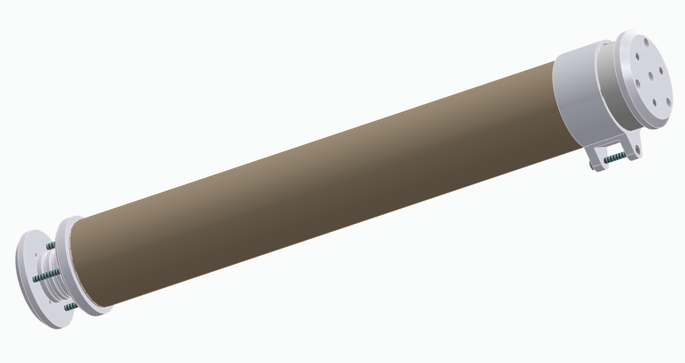

  

---

A mobile storage for technical drawings!

## Idea / Concept

As larger paper like A2 and above require either folding, rolling or other ways to be transported in a meaningful way and I personally dislike folding any paper for purposes other than origami (which I actually love), I took one of the cardboard rolls where you usually keep stuff like posters in and used it for my technical drawings.

## Final design & build

The final CAD design, created in Solid Edge, is available in the root of the repo. Below is a capture of the assembly and a snapshot of the [assembly drawing](export/a_drroll.pdf):

  
  

more images of the real life build can be found in the project log and a lot of concept art is available in the [project log](documentation/project_log.md)! 