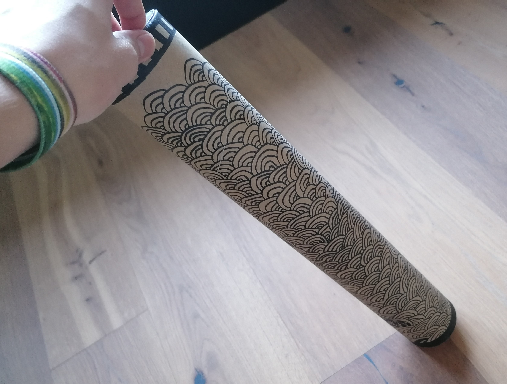
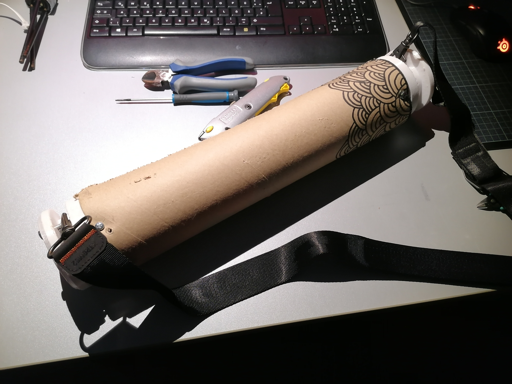
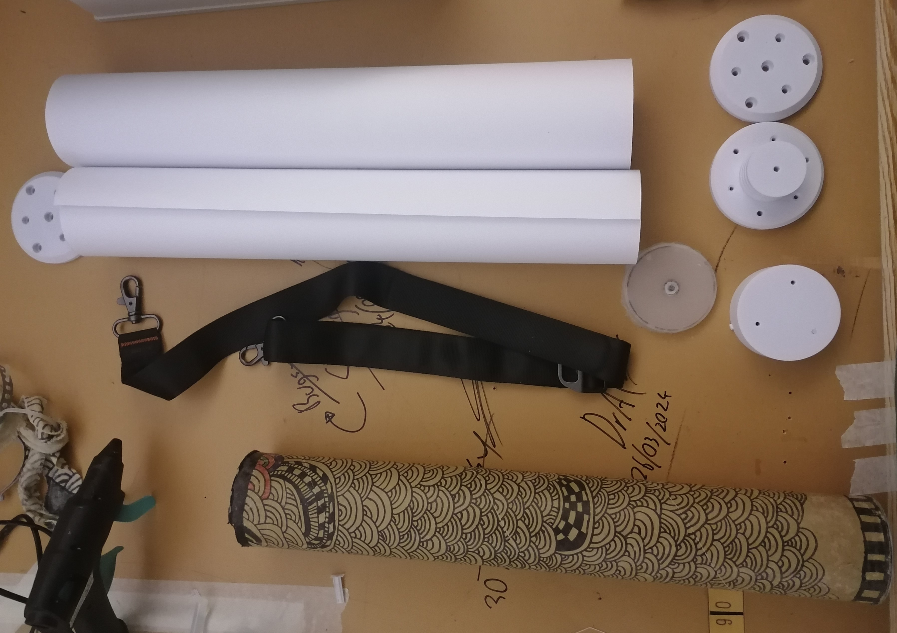

# Project Log

## Project cause

I always loved drawing on these large A1 & A2 sheets and making huge technical drawings, with quite the detail, on them. However I hated folding them and it made clean drawing on these sheets hard on the folded edges. I also personally don't like the look of it. 

Soon I came across one of those cardboard rolls, that you usually transfer posters and similar in, and it quickly became quite handy for this purpose of transporting my drawings. First I used to tie the roll to my backpack using some strings and ropes. But as these cardboard rolls are not designed for longer term use, especially the caps, and they have no handles or attachments for belts and similar, I soon needed some custom attachments to the roll.

## First attachments and own project - Mk1 (abt. 2022/06)

Sadly I barely have any files left of the first roll and reasons why I made some design choices, however I have this image:

For this build, I used a new cardboard roll and tried to design my own caps with some connectors to them. Sadly this design was absolute trash, there was little to no possibility to open the roll in a clean why, so I discarded this design very quickly.

## Concept for Mk2

The new Mk2 build should have a fixed bottom end with multiple screws and possible mounting options. However the top part should have something like a little hook on the side to mount the belt too, while also functioning as a seal.

## First build of Mk2 (Mk2.0.0)

The first build was finished on the 30/09/2024 and was directly put to use when I was travelling to Switzerland. The following things came up while or after traveling:

- The top part is not fully centred, as the roll appears to be larger than planned, probably because it was stretched over time by the cap used
- The new bottom part is not only extremely useful, but also very, very stable. It is likely that there are no further changes to be made to this part of the roll

The issues with the top part caused wrapping, which made using the roll basically impossible:

    
    
    

## Fixed version (Mk2.1.0)

With Mk2.1.0 I was able to remove all of the issues listed in Mk2.1.0, hopefully no new ones will emerge for now. Here a very low quality picture of the result (it was a quick picture for my best friend please excuse haha):

## Durability problems in winter (Mk2.2.0)

Now two months into use, the DrRoll is showing the first signs of longer-term usage. With the colder temperatures and higher moisture conditions, the 3D-printed parts seem to deform in a way, causing the glue between the cardboard to lose it's strength. This inevitably led to the bottom part, the one with less area where glue is spread on, broke free from the cardboard roll. 

    
    
    

Additionally, the old cap did not only have little connection-area to the cardboard roll, it also had little space for the screws to be put though. So for the next version, I took the upper connection part as a reference and increased the thread length to properly fit the screws in. The new roll bottom looks like the following:

    
    

